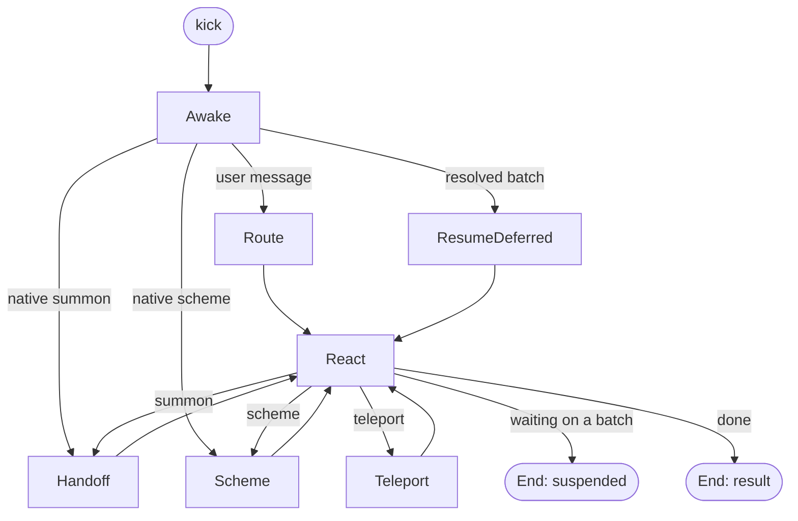

# The reflex graph

A message arrives, an answer goes out, and between the two something decides which
agent runs, where, with what context, and what happens when the agent stops to ask.
That something is the reflex graph, a [pydantic-graph](https://ai.pydantic.dev/graph/)
in `octomate/reflex/`.

## Declared, not dispatched

Every edge comes from a node's own `run` return annotation. A node that can hand
off is typed as returning `Handoff`; one that ends returns `End`. There is no
dispatcher table, so the graph's shape is read off the nodes, and the builder
validates that every node is reachable from the entry.

## The nodes

**Awake** resolves the signal once and writes the source context into state. Three
signals enter here: a user message from a channel, a resolved action batch coming
back from a card, and a hand-off a native session requested over MCP. A message
enters the thread its address names, or a fresh sub-thread when the address is a
chat room. See [Threads and chat rooms](../usage/threads.md).

**Route** decides who runs this turn, in order: the agent a handoff already pinned
on the chat; the channel's default agent when the message is already in a flat
thread; otherwise the channel's default agent, in the same conversation, with no
handoff recorded, because a group's main surface is never pinned. There is no
separate triage pass: the entry agent self-routes with the gateway if it wants to.

**React** is the only node that runs an agent. It resolves the agent against the
channel the run will happen on, records the handoff if one is pending, mounts the
gateway and the user's capabilities, registers the session at the gateway so a
second concurrent turn is refused, then runs the agent, streaming through the
channel's feelers or presenting the result once. After the run it reads what the
gateway recorded: a summon becomes `Handoff`, a scheme becomes `Scheme`, a teleport
deferral becomes `Teleport`, any other deferral ends the graph suspended, and a
plain result ends it. Whatever happened, the turn's workspace is saved.

**Handoff** performs a summon: takes over in place, opens a sub-thread and posts the
hint, or crosses into someone's direct messages on another channel, then re-enters
`React` with the brief as the new agent's prompt. If nothing could be opened on a
group's main surface, the turn ends with the agent that already replied rather than
pinning an owner.

**Scheme** opens the asking user's direct messages with the hint, finds who already
owns that DM or falls back to that channel's default agent, and re-enters `React`
as an ordinary hand-off with the brief.

**Teleport** carries the same agent somewhere else: opens the sub-thread or the
crossing, forks the conversation's messages into the landed thread, binds the
project and forks its workspace if one was named, relocates the agent's session,
and re-enters `React` with the teleport call answered by a sentence saying where it
now is.

**ResumeDeferred** takes a resolved batch, rebuilds the target from what the batch
persisted, finds the thread through the conversation rather than the address (a
chat-room kick ran in a sub-thread), restores the user's profile so the resumed run
keeps the same capabilities and prompt prefix, and re-enters `React` with the
batch's answers as tool results and no new prompt.

## Suspending and resuming

A run ends suspended when its output is a set of deferred tool requests the run
could not resolve itself. The suspender classifies them by the metadata each
deferral declares, never by tool name: a `teleport` kind goes back to the graph, and
everything else becomes a persisted **batch** with every address, mode and decision
the graph needs to come back. On a streaming channel the batch is handed to the
timeline as one event to render; otherwise the channel's feelers present the cards
directly.

The batch is a row. When the cards are answered, possibly after a restart, the
channel kicks the graph with the batch id, `ResumeDeferred` rebuilds the state from
the row, and `React` resumes the agent's conversation. Inkling resumes through the
graph with the answers as tool results; a harness that takes no tool result back
is given the answers as its next prompt. An agent that parked a live process
instead, as the harness bridges do, is answered in place if the process is still
there, and the graph path is the fallback.

## The inner graph

Inkling has a second, smaller graph per turn: start or resume, run the agent,
resolve deferrals. A deferral is first offered to the conversation's posture, which
under `dontAsk` or `bypassPermissions` answers it in process, and only what is left
reaches the suspender. That is why an Inkling run can keep going through an
approval that the posture already granted, and why a whole batch goes to the human
when any part of it needs one.

The graph runs inside a single `kick`, under one Arcanus materia context, with
Logfire spans per node. The state object carries the resolved source, the target,
the pending handoff, the user profile and the prompt; nodes read it and carry only
transition discriminators of their own.
