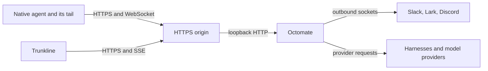

# Networking

Start on `127.0.0.1:8000`. Once the server, your account and the client work
locally, decide how other devices reach it. The CLI provisions no domain, no TLS, no
tunnel and no reverse proxy.

!!! warning "Keep Octomate off the public internet"
    Octomate includes a simple user login and API tokens, but public internet
    exposure is not recommended. Keep the server on loopback and use Tailscale,
    another private network or an SSH tunnel to reach it from your devices.
    Keep Octomate authentication enabled as well.

## Who connects to what



Every channel dials out: Slack over Socket Mode, Lark over its long connection,
Discord over the Gateway. Ordinary
chat needs no inbound URL. What needs a reachable origin is what you point at
Octomate yourself: remote native clients, the console, and OAuth callbacks.

## Same machine

`http://127.0.0.1:8000` for both the console and `octomate configure`. Plain HTTP
needs `auth.cookie_secure: false`. A browser on another machine sees its own
loopback, not the server's.

## Tailscale

Tailscale connects your devices through a private network called a tailnet.
[Tailscale Serve](https://tailscale.com/docs/features/tailscale-serve) can give the
local Octomate server an HTTPS address reachable within that network. Connect the
server and your client devices to your tailnet, restrict access to the people who
need it, then run on the server:

```sh
tailscale serve --bg http://127.0.0.1:8000
```

Follow Tailscale's prompt to enable HTTPS if needed. Use the HTTPS URL it prints
for Trunkline and `octomate configure`, set `auth.cookie_secure: true`, and restart
Octomate. Keep Octomate bound to `127.0.0.1`; Serve forwards requests to it. Use the
same origin for OAuth callbacks when required. Tailscale Serve is private to your
tailnet; Tailscale Funnel exposes a service publicly and is unsuitable for this
setup. See the [Serve command reference](https://tailscale.com/docs/reference/tailscale-cli/serve)
for status and lifecycle controls.

## Other private HTTPS proxies

Put an HTTPS reverse proxy reachable only through your private network in front, and keep
the server on loopback behind it. Use one hostname everywhere: client configuration,
`oauth.callback_base_uri`, and the redirect URLs you register with providers.

The proxy has to preserve:

| Surface | Requirement |
|---|---|
| `/` | Trunkline's static files and its client-side routes |
| `/api/...` | Cookies, and the `X-Octomate-Request` header on writes |
| `/api/trunkline/...` | Long-lived SSE responses without buffering |
| `/hooks/<runtime>` | Authenticated POSTs |
| `/hooks/<runtime>/stream` | WebSocket upgrade, long-lived |
| `/octomate/mcp` | Streamable HTTP with the `Authorization` and `X-Octomate-*` headers |
| `/oauth/...` | The exact callback paths and their query strings |

Raise idle timeouts for the stream and SSE paths. A short request timeout looks like
a working connection whose answers stop arriving. Keep the console and the API on
one origin, and once HTTPS works set `auth.cookie_secure: true`.

An outbound proxy for provider traffic, `HTTPS_PROXY` and friends, is a separate
concern. The macOS wizard copies those variables into the service environment;
make sure loopback traffic is excluded with `NO_PROXY`.

## Private access

A private network or an SSH tunnel can provide access without a public Octomate
endpoint. They produce different client URLs:

- **Private network:** use the server's address on that network. A service bound
  only to loopback still needs a proxy or forward listening on the private address.
- **SSH port forward:** use the client's local forwarded address, such as
  `http://127.0.0.1:8000`, while the SSH connection is open.

Octomate API tokens still identify each user. If the browser connects over plain
HTTP, use `cookie_secure: false`; use `true` for HTTPS. Set up and supervise the
network connection outside Octomate, and choose an OAuth callback origin the
authorising browser can actually reach.

## OAuth callbacks

`oauth.callback_base_uri` is the origin the **browser** reaches, with no path. The
callback a provider must know is `<origin>/oauth/<tentacle id>/callback`, character
for character. A private origin works if the authorising browser can reach it and
the provider accepts the redirect. Slack's channel block has its own
`oauth.callback_base_uri` for the same reason.

## Verify from the remote device

1. Sign in through the final origin and reload. The session should survive.
2. Repeat the [anonymous checks](server.md#run-and-verify) against that origin.
3. Configure a client with the final URL and reinstall its MCP entry.
4. Send a native prompt and watch the whole answer reach Trunkline.
5. Call `gateway_scry` over MCP, then exercise one OAuth callback if configured.

If HTTP works but answers stop, look at WebSocket forwarding and stream timeouts
before reinstalling anything.
