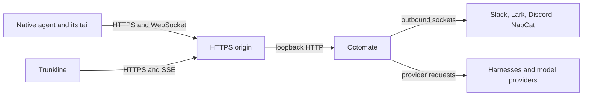

# Networking

Start on `127.0.0.1:8000`. Once the server, your account and the client work
locally, decide how other devices reach it. The CLI provisions no domain, no TLS, no
tunnel and no reverse proxy.

## Who connects to what

Every channel dials out: Slack over Socket Mode, Lark over its long connection,
Discord over the Gateway, NapCat over a WebSocket you point at the bridge. Ordinary
chat needs no inbound URL. What needs a reachable origin is what you point at
Octomate yourself: remote native clients, the console, and OAuth callbacks.

## Same machine

`http://127.0.0.1:8000` for both the console and `octomate configure`. Plain HTTP
needs `auth.cookie_secure: false`. A browser on another machine sees its own
loopback, not the server's.

## Remote clients

Put an HTTPS reverse proxy or a private-network HTTPS endpoint in front, and keep
the server on loopback behind it. Use one hostname everywhere: client configuration,
`oauth.callback_base_uri`, and the redirect URLs you register with providers.

The proxy has to preserve:

| Surface | Requirement |
|---|---|
| `/` | Trunkline's static files and its client-side routes |
| `/api/...` | Cookies, and the `X-Octomate-Request` header on writes |
| `/api/trunkline/...` | Long-lived SSE responses without buffering |
| `/hooks/<runtime>` | Authenticated POSTs |
| `/hooks/<runtime>/stream` | WebSocket upgrade, long-lived |
| `/octomate/mcp` | Streamable HTTP with the `Authorization` and `X-Octomate-*` headers |
| `/oauth/...` | The exact callback paths and their query strings |

Raise idle timeouts for the stream and SSE paths. A short request timeout looks like
a working connection whose answers stop arriving. Keep the console and the API on
one origin, and once HTTPS works set `auth.cookie_secure: true`.

An outbound proxy for provider traffic, `HTTPS_PROXY` and friends, is a separate
concern. The macOS wizard copies those variables into the service environment;
make sure loopback traffic is excluded with `NO_PROXY`.

## A private tunnel instead

For a small circle without a public hostname, a device-authenticated tunnel such as
[Tailcat](https://tailscale.com/tailcat) or a Tailscale network reaches the server
without exposing port 8000. The tunnel decides which machines connect; Octomate's
tokens still decide which user each request is. Clients then configure the tunnel's
local forward as their URL, and the console runs over plain HTTP on it with
`cookie_secure: false`. Set up and supervise the tunnel outside Octomate.

## OAuth callbacks

`oauth.callback_base_uri` is the origin the **browser** reaches, with no path. The
callback a provider must know is `<origin>/oauth/<tentacle id>/callback`, character
for character. A private origin works if the authorising browser can reach it and
the provider accepts the redirect. Slack's channel block has its own
`oauth.callback_base_uri` for the same reason.

## Verify from the remote device

1. Sign in through the final origin and reload. The session should survive.
2. Repeat the [anonymous checks](server.md#run-and-verify) against that origin.
3. Configure a client with the final URL and reinstall its MCP entry.
4. Send a native prompt and watch the whole answer reach Trunkline.
5. Call `gateway_scry` over MCP, then exercise one OAuth callback if configured.

If HTTP works but answers stop, look at WebSocket forwarding and stream timeouts
before reinstalling anything.
