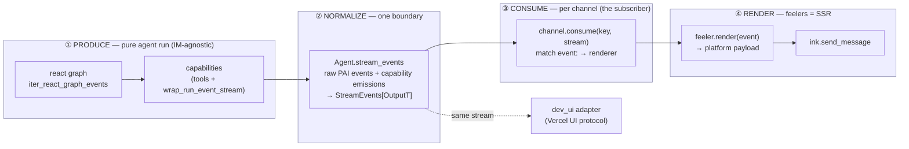
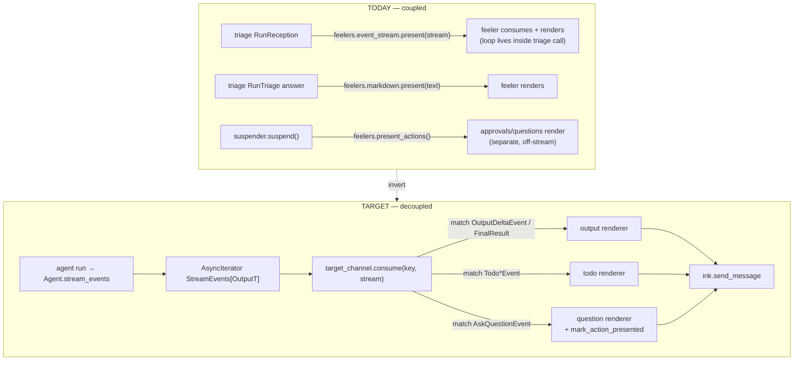
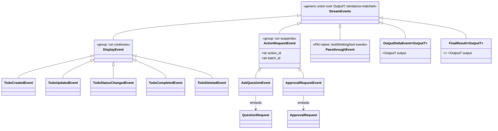
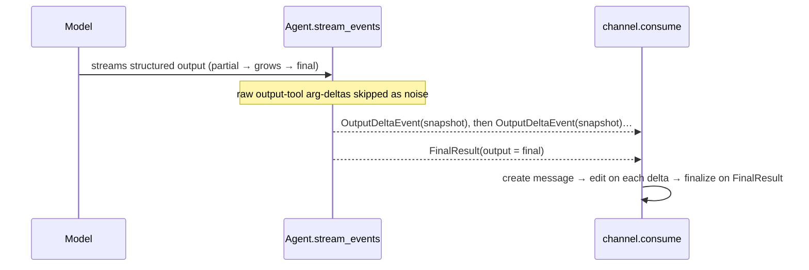
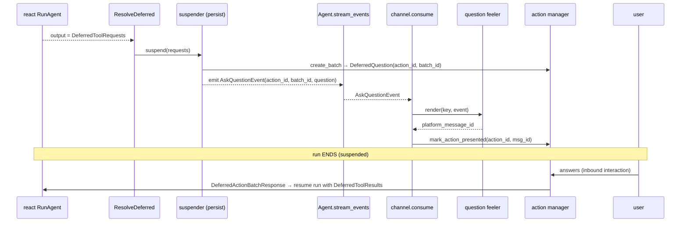
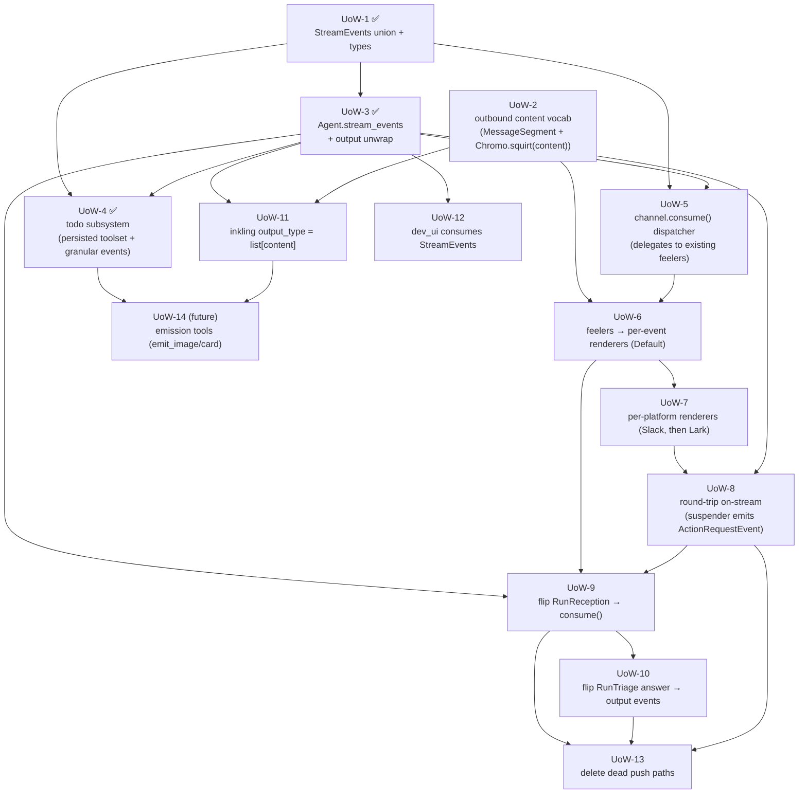

# Plan: Decouple the agent run into a typed event stream that channels consume

> **Status:** in progress · **Owner:** @luhui · **Created:** 2026-06-07 · **Updated:** 2026-06-08
> **Scope:** the boundary between the agent run (triage/react graphs) and IM channels (Slack/Lark/NapCat) + the dev web UI.

> **Drift log — read this first.** UoW-1 and UoW-3 have landed, and the implementation
> diverged from this doc's original vocabulary. The four-layer vision (produce →
> normalize → consume → render) is unchanged; the names/paths below are corrected
> in place, but the key deltas are:
>
> - **`Say` lifecycle trio → `OutputDeltaEvent[OutputT]` + Pydantic AI's own
>   `FinalResult[OutputT]`.** Streaming a structured reply surfaces partial validated
>   snapshots as `OutputDeltaEvent` then the final typed value as `FinalResult` (no
>   octomate wrapper). Rendering output → segments is a *consumer* concern.
> - **`octo_stream()` (free fn) → `Agent.stream_events` (method)** on the `Agent`
>   subclass. It also applies each capability's `wrap_run_event_stream` per node so
>   capability-injected events flow (the manual `iter()` path otherwise bypasses it).
> - **New `octomate.capabilities` package** holds the harness: `events.py` (was
>   `schemas/stream.py`), `agent.py` (the normalizer), `deferred.py` (the
>   `DeferredResolver`/`DeferredSuspender` protocols; `graph/resolver.py` deleted),
>   and `react.py` (was `tentacles/agent/graph/react.py`).
> - **`OctoStreamEvent` (Annotated discriminated union + `TypeAdapter`) →
>   `StreamEvents` (generic `TypeAliasType`, isinstance-matched).** A single
>   discriminated `TypeAdapter` no longer fits generics; serialization is deferred to
>   the transport layer (dev_ui / UoW-12).
> - **UoW-4 grew** from "first display capability" into a persisted, conversation-scoped
>   **todo subsystem** (Arcanus `todos` table + `TodoManager`, the 8-tool
>   `pydantic-ai-todo`-style toolset with subtasks/dependencies, and **granular** todo
>   events). See the UoW-4 row.

---

## TL;DR

Today the **triage graph pushes rendered output into channel feelers mid-run** — agent-run logic is coupled to IM delivery. We will invert this:

- The **agent run becomes a pure producer** of a single, precisely-typed event stream (`StreamEvents[OutputT]`).
- **Channels subscribe** to that stream and render it themselves — exactly like the web UI already does via `iter_react_graph_events`.
- **Feelers become pure SSR-style renderers**: one typed event in → one platform payload out. No agent knowledge.
- **New event types are capabilities**: an agent that has capability *X* can emit event *X* (questions, todo lists, images, …). Adding a type = adding a capability + a renderer, with the compiler enforcing exhaustiveness.

Everything the user sees lives on **one plane** (the event stream); the agent-framework's `output` is demoted from "content carrier" to "typed programmatic result," and round-trip interactions (questions/approvals) keep Pydantic AI's **native deferred-tool** resume underneath while their *presentation* joins the unified stream.

---

## 1. The vision



**Four layers, one rule.** Source (output vs tool-call vs deferred) is a *producer-side mechanism* and must never reach a feeler. The stream is keyed on **render-kind + lifecycle**; the normalizer absorbs every source into that union.

---

## 2. Current vs. target



| | Today | Target |
|---|---|---|
| Who drives the stream loop | triage (`stream_events()` inside `RunReception`) | the **channel consumer** |
| What triage does after deciding target | renders inline via `feelers.*.present()` | hands the stream to `channel.consume()` |
| Questions/approvals | rendered off-stream via `present_actions()` | rendered **on-stream** as `ActionRequestEvent`; persistence unchanged |
| Output content | `markdown_from_output()` at end of `RunReception` | `OutputDeltaEvent[OutputT]` (partial) + `FinalResult[OutputT]` (final) from `Agent.stream_events`; rendering output → segments is a *consumer* concern |
| Feeler role | consume *and* render | **render only** (one event → one payload) |

---

## 3. Core concepts / glossary

| Term | What it is | Anchor in code |
|---|---|---|
| **Producer** | the pure agent run that yields raw `AgentStreamEvent \| AgentRunResultEvent` | `iter_react_graph_events` ([capabilities/react.py](../../octomate/capabilities/react.py)) |
| **`StreamEvents[OutputT]`** | the typed event stream the system speaks; a generic `TypeAliasType` union (not one discriminated `TypeAdapter`), matched by `isinstance` | [capabilities/events.py](../../octomate/capabilities/events.py) |
| **`DisplayEvent`** | fire-and-forget, mid-run; run continues (message, todo, image, progress) | [capabilities/events.py](../../octomate/capabilities/events.py) |
| **`ActionRequestEvent`** | needs a user reply; run suspends; carries `action_id`/`batch_id` | embeds `QuestionRequest`/`ApprovalRequest` ([capabilities/events.py](../../octomate/capabilities/events.py)) |
| **Normalizer** | maps every PAI source + capability emission into `StreamEvents` | `Agent.stream_events` ([capabilities/agent.py](../../octomate/capabilities/agent.py)) |
| **Consumer** | per-channel loop that `match`es each event to a renderer | *new* `ChannelTentacle.consume()` |
| **Feeler** | SSR renderer: one typed event → one platform payload | refactor of [feelers/output.py](../../octomate/tentacles/channel/feelers/output.py) |
| **Capability = event type** | `AbstractCapability` bundling a tool + instructions + `wrap_run_event_stream` | `pydantic_ai.capabilities.AbstractCapability` |
| **Content vocabulary** | the bidirectional `MessageSegment` union (Text/Image/Markdown/Card/…) | [schemas/segments.py](../../octomate/schemas/segments.py) |

---

## 4. The `StreamEvents` model

Variants are distinct types, matched by `isinstance` — display vs round-trip is a **compile-time fact**, never a runtime flag. The union is a generic `TypeAliasType` (over the run's `OutputT`); a single discriminated `TypeAdapter` no longer fits the generic output events.



> **Output & streaming decisions (UoW-1/UoW-3, landed in [capabilities/events.py](../../octomate/capabilities/events.py) + [capabilities/agent.py](../../octomate/capabilities/agent.py)):**
> - The outbound reply is **not** wrapped: streaming surfaces partial *validated* snapshots as `OutputDeltaEvent[OutputT]`, then the final typed value as Pydantic AI's own `FinalResult[OutputT]`. `run_stream_events` alone only exposes raw arg-deltas + the final object, so `Agent.stream_events` drives `iter()` and validates per node (the stream-whales pattern).
> - **One union, generic:** `StreamEvents[OutputT]` is a `TypeAliasType` union of PAI passthrough + octomate events, matched by `isinstance`. A single discriminated `TypeAdapter` no longer fits; serialization is deferred to the transport layer (dev_ui / UoW-12).
> - Display/action events (todo, questions, approvals) are emitted by **capabilities** via `wrap_run_event_stream`, which `Agent.stream_events` applies per node so the events reach the consumer.

```python
# octomate/capabilities/events.py  (abridged)
from pydantic_ai import AgentStreamEvent
from pydantic_ai.result import FinalResult
from octomate.schemas.deferred import QuestionRequest, ApprovalRequest   # reuse args payloads
from octomate.schemas.todos import Todo

@dataclass
class OutputDeltaEvent(Generic[OutputT]):          # partial validated reply snapshot
    output: OutputT
    event_kind: Literal['output_delta'] = 'output_delta'

class DisplayEvent(BaseModel): ...                 # fire-and-forget; run continues

class TodoCreatedEvent(DisplayEvent):
    event_kind: Literal['todo_created'] = 'todo_created'
    todo: Todo
# … TodoUpdatedEvent / TodoStatusChangedEvent / TodoCompletedEvent / TodoDeletedEvent
#    (the status-bearing ones also carry `previous: Todo | None`); TodoEvent unions them.

class ActionRequestEvent(BaseModel):               # run suspends; reply needed
    action_id: str
    batch_id: str
class AskQuestionEvent(ActionRequestEvent):
    event_kind: Literal['ask_question'] = 'ask_question'
    question: QuestionRequest                       # ← reuse, don't redeclare
class ApprovalRequestEvent(ActionRequestEvent):
    event_kind: Literal['approval_request'] = 'approval_request'
    approval: ApprovalRequest

StreamEvents = TypeAliasType(                        # generic union; isinstance-matched
    "StreamEvents",
    AgentStreamEvent                                # PAI passthrough: text/thinking/tool calls
    | OutputDeltaEvent[OutputT] | FinalResult[OutputT]
    | TodoEvent | AskQuestionEvent | ApprovalRequestEvent,
    type_params=(OutputT,),
)
```

The consumer matches by type:

```python
match event:
    case OutputDeltaEvent():      await feelers.output.update(key, event)   # partial reply
    case FinalResult():           await feelers.output.finish(key, event)   # final typed value
    case TodoCreatedEvent() | TodoUpdatedEvent() | TodoStatusChangedEvent() \
        | TodoCompletedEvent() | TodoDeletedEvent():
                                  await feelers.todo.render(key, event)
    case AskQuestionEvent():      await feelers.question.render(key, event); await mark_presented(...)
    case ApprovalRequestEvent():  await feelers.approval.render(key, event); await mark_presented(...)
    case PartDeltaEvent():        await feelers.message.append(key, event)  # PAI passthrough text
    case _:                       ...   # remaining PAI passthrough events
```

(The union mixes our events with PAI's open `AgentStreamEvent` family, so the catch-all handles passthrough rather than an `assert_never`.)

---

## 5. Output unwrap (the "output is already on the stream" insight)

`Agent.stream_events` drives `iter()` and ends with `AgentRunResultEvent(result=...)`; `result.output` is the **validated, typed** object. While the model node streams, it emits `OutputDeltaEvent[OutputT]` for each partial *validated* snapshot, then Pydantic AI's own `FinalResult[OutputT]` as the final value (verified: `run_stream_events` alone only exposes raw arg-deltas + the final object, *not* partial validated snapshots). There is no separate output render path and no octomate wrapper — `FinalResult` is emitted directly.



> **Caveat (decided):** `output` is terminal, so a streamed structured reply still completes at end-of-run, never interleaved with a mid-run question. For agents that need to talk *while* working, use **emission tools** (mid-run capability events) instead; the two compose. `output_type` is kept only where a *code* caller (sub-agent/eval) consumes a typed result.

---

## 6. Round-trip: unified presentation, deferred-native resume

Questions/approvals render **on the stream** but pause/resume via Pydantic AI's deferred-tool machinery + the existing `DeferredActionBatch`. The suspender shifts from *persist + render* to *persist + emit event*; the consumer renders and reports the platform message id back.



> **Trickiest UoW (UoW-8):** batch must exist before the event is emitted (so `action_id` is real), and the consumer must call `mark_action_presented` *after* rendering (the renderer returns the platform message id). Keep persistence in the suspender/action-manager; move only presentation onto the stream.

---

## 7. Units of work

Designed to **land incrementally and keep the system working** at every step: build the new path additively, prove parity, flip triage, then delete the old path.

### Dependency DAG



### Work table

| UoW | Title | Depends on | Deliverable / acceptance | Risk |
|---|---|---|---|---|
| **1** ✅ | `StreamEvents` union + variants | — | **Landed** in [capabilities/events.py](../../octomate/capabilities/events.py): `OutputDeltaEvent`, `DisplayEvent`, granular `Todo*Event`s, `Ask`/`Approval`; embeds `QuestionRequest`/`ApprovalRequest`; generic `TypeAliasType` (no `TypeAdapter`). **Pure types, zero wiring.** | 🟢 low |
| **2** | Outbound content vocabulary | — | Confirm `MessageSegment` covers Markdown/Image/Url/Card; add `Url` if missing. Evolve `Chromo.squirt` to render a `MessageSegment`/content (today it takes `AgentRunResult`). Inbound `sip` ↔ outbound `squirt` symmetry. | 🟡 med (touches every Chromo) |
| **3** ✅ | Normalizer `Agent.stream_events` | 1 | **Landed** in [capabilities/agent.py](../../octomate/capabilities/agent.py): an `Agent` subclass method (not a free `octo_stream()`) that drives `iter()` — text/thinking passthrough, drop output-tool noise, emit `OutputDeltaEvent[OutputT]` (partials) + `FinalResult[OutputT]` (final), apply each capability's `wrap_run_event_stream` per node; `DeferredToolRequests` left for the suspender (UoW-8). Tested via `TestModel`. | 🟢 low |
| **4** ✅ | Persisted todo subsystem (first capabilities) | 1, 3 | **Landed**: Arcanus `todos` table + `TodoManager` (conversation-scoped, keyed on a short hex `ref`); a `pydantic-ai-todo`-style `TodoCapability` (8 tools incl. subtasks/dependencies) that persists and stashes **granular** todo events on `ToolReturn.metadata`; `Agent.stream_events` gains `conversation_id` and forwards capability events. Concrete capability, **no `EventEmittingCapability` base** (premature). Not yet wired into inkling or rendered (UoW-6/7/9). Tested: manager CRUD + `TestModel` create-path + wrap injection. | 🟡 med |
| **5** | `channel.consume()` dispatcher | 1, 3 | `ChannelTentacle.consume(key, stream)`: `match` → renderer. Initially **delegates to existing feelers** so behaviour is unchanged. | 🟢 low |
| **6** | Feelers → per-event renderers (Default) | 2, 5 | Refactor `DefaultEventStreamFeeler` into per-variant `render()` methods; reuse `render_stream_event_delta` ([output.py:265](../../octomate/tentacles/channel/feelers/output.py#L265)) + `TextStreamBatcher`. | 🟡 med |
| **7** | Per-platform renderers | 6 | Slack renderers for `Message`/`Todo`/`Ask`/`Approval` (reuse `slack/feelers/*`), then Lark, then NapCat. **One PR per platform.** | 🟡 med |
| **8** | Round-trip on-stream | 3, 7 | Suspender persists batch then **emits `ActionRequestEvent`** (instead of `present_actions`); consumer renders + `mark_action_presented`. Keep batch/resume intact. *(See §6 ordering note.)* | 🔴 high |
| **9** | Flip `RunReception` to `consume()` | 3, 5, 6/7, 8 | Replace [triage.py:469](../../octomate/tentacles/agent/graph/triage.py#L469) `feelers.event_stream.present(...)` and the non-stream `markdown_from_output` branch with `await target_channel.consume(key, agent.stream_events(...))`. Parity-verify on one platform behind `config.stream`. *(Wires `TodoCapability` into inkling here.)* | 🔴 high |
| **10** | Flip `RunTriage` answer path | 9 | Replace [triage.py:325](../../octomate/tentacles/agent/graph/triage.py#L325) `feelers.markdown.present(...)` with the output events (`OutputDeltaEvent`/`FinalResult`) through `consume()`. | 🟡 med |
| **11** | Inkling rich output | 2, 3 | Set inkling `output_type = list[MessageSegment-content]` (or keep `str` + emission). Output unwrap (UoW-3) fans it into messages. Realizes rich-media output. | 🟡 med |
| **12** | dev_ui on `StreamEvents` | 3 | Either an octomate `UIEventStream` subclass mapping `StreamEvents[...]`→Vercel chunks, or have dev_ui consume `Agent.stream_events(...)`. Prevents stock Vercel adapter from dropping custom events. | 🟡 med |
| **13** | Delete dead push paths | 9, 10, 8 | Remove `EventStreamFeeler`/`MarkdownStreamFeeler` push usage, inline `markdown_from_output` in triage, `present_actions` rendering. Triage = routing only. | 🟢 low (after flips) |
| **14** | Emission tools (future) | 4, 11 | `emit_image`/`emit_card`/… capabilities for mid-run, interleaved media. | 🟢 low (additive) |
| **15** | Outbound targeting | 5, 9 | Add `target` to outbound events; channel dispatcher routes to the chosen channel/conversation. Agent picks from a **system-resolved** target set (authz + cross-channel identity owned by the system). See §8 decision. | 🔴 high |

### Suggested landing order (PR-sized)

1. **UoW-1** → **UoW-3** → **UoW-4** — types + normalizer + first capability, all behind no behaviour change (unit tests only).
2. **UoW-2** → **UoW-6** → **UoW-5** — content vocab + renderers + consumer (still delegating; no flip yet).
3. **UoW-7 (Slack)** — prove renderers on one platform.
4. **UoW-8** — round-trip on-stream (the hard one; do it isolated).
5. **UoW-9 (Slack, flagged)** → verify parity → **UoW-10** → roll out **UoW-7 (Lark/NapCat)** → un-flag.
6. **UoW-11**, **UoW-12** — rich output + web parity.
7. **UoW-13** — delete the old path. **UoW-14** when wanted.

---

## 8. Risks & open decisions

- **🔴 Deferred ordering (UoW-8).** Batch-before-emit, present-then-mark. Recommended: give the suspender the stream handle so it emits `ActionRequestEvent`s carrying real `action_id`s; consumer calls `mark_action_presented` with the renderer's returned message id. Don't move persistence out of the action manager.
- **🟡 Typed boundary for custom events.** `wrap_run_event_stream` is typed `AsyncIterable[AgentStreamEvent]`; yielding our display events (e.g. `Todo*Event`) needs one `cast` at that single seam (done in [capabilities/todos.py](../../octomate/capabilities/todos.py)). Pydantic AI does **not** runtime-validate the stream, and `wrap_run_event_stream` does **not** touch message history — so this is safe (history is rebuilt from response *parts*, independent of the stream).
- **🟡 dev_ui drop.** Pydantic AI's stock `VercelAIEventStream.handle_event` ignores unknown events (`case _: pass`) — UoW-12 must add explicit handling or dev_ui silently loses custom events.
- **🟡 Two graphs.** `react_graph` (producer, already streaming) vs `triage_graph` (router, currently coupling). Keep the split; triage hands streams to channels, it does not render. Preserve the **DeferredResolver + DeferredSuspender two-hook** design — do not merge them.
- **Decision — emission vs output for media.** Default to **terminal-output unwrap** (UoW-11) for "produce the reply" turns; reach for **emission tools** (UoW-14) only when the agent must message mid-run. Gut-check with the team that "model tool-calls to send rich content" is acceptable (it is how Claude Code's own tools work).
- **🟡 Decision — outbound targeting (UoW-15).** The agent should be able to route an outbound event to a *different* channel (e.g. "from channel A, send the summary to channel B to me"). The "to me on channel B" phrasing exposes **cross-channel identity**: the agent must not construct raw addresses (it would need the user's `chat_id`/`user_id` on B and could reach unauthorized conversations). **Recommended:** the agent picks a target by **id from a system-offered, pre-resolved set** — the existing `candidates` + `decision.target_id` pattern ([triage.py:233](../../octomate/tentacles/agent/graph/triage.py#L233)) — and the **system owns address/identity resolution + authorization**. Open question: how broad is the offered set (origin-only / explicitly-mentioned channels / all channels where the user is known). Lives on the outbound events as a future `target` field (omitted from UoW-1 to stay minimal) and is applied by the channel dispatcher.

---

## 9. Appendix — file change map

| Area | File | Change |
|---|---|---|
| Producer | [capabilities/react.py](../../octomate/capabilities/react.py) ✅ | moved here from `tentacles/agent/graph/react.py`; unchanged behaviour (already streams); possibly expose stream handle to suspender for UoW-8 |
| Router | [triage.py](../../octomate/tentacles/agent/graph/triage.py) | remove `feelers.*.present` pushes (UoW-9/10); route stream to `channel.consume` |
| Suspender | [suspender.py](../../octomate/tentacles/agent/graph/suspender.py) | persist + emit `ActionRequestEvent` instead of `present_actions` (UoW-8); `DeferredResolver`/`DeferredSuspender` protocols moved to [capabilities/deferred.py](../../octomate/capabilities/deferred.py) ✅ (`graph/resolver.py` deleted) |
| Stream types | [capabilities/events.py](../../octomate/capabilities/events.py) ✅ | `StreamEvents` union + variants (UoW-1); was the planned `schemas/stream.py` |
| Normalizer | [capabilities/agent.py](../../octomate/capabilities/agent.py) ✅ | `Agent.stream_events` + output unwrap + capability wrap (UoW-3); was the planned free `tentacles/agent/stream.py` |
| Consumer | [channel/base.py](../../octomate/tentacles/channel/base.py) | `consume()` dispatcher; drop feeler-as-consumer (UoW-5) |
| Renderers | [feelers/output.py](../../octomate/tentacles/channel/feelers/output.py), `slack/feelers/*`, `lark/feelers/*` | per-event `render()` (UoW-6/7) |
| Content | [schemas/segments.py](../../octomate/schemas/segments.py), [channel/base.py](../../octomate/tentacles/channel/base.py) Chromo | outbound vocab + `squirt(content)` (UoW-2) |
| Todo persistence | [models/todos.py](../../octomate/models/todos.py), [schemas/todos.py](../../octomate/schemas/todos.py), [managers/todos.py](../../octomate/managers/todos.py) ✅ | conversation-scoped `todos` table + `TodoManager` (UoW-4) + alembic migration |
| Actions | [schemas/deferred.py](../../octomate/schemas/deferred.py) | reuse `QuestionRequest`/`ApprovalRequest` in events (UoW-1/8) |
| Web | [web/dev_ui/adapter.py](../../octomate/web/dev_ui/adapter.py) | consume `StreamEvents` (UoW-12) |
| Capabilities | [capabilities/todos.py](../../octomate/capabilities/todos.py) ✅ | `TodoCapability` (UoW-4); future `emit_image`/`emit_card` (UoW-14) |

### Pydantic AI 1.93.0 facts this plan relies on

- `AgentStreamEvent` is a **closed** discriminated union (`messages.py:2657`) but **not runtime-validated** on the live stream → foreign events propagate to our consumers.
- `AbstractCapability.wrap_run_event_stream` (`capabilities/abstract.py:437`) and `ProcessEventStream` can **add/drop/transform** events.
- Deferred tool calls **still emit `FunctionToolCallEvent`** in the stream (`_agent_graph.py:1689`) before becoming `DeferredToolRequests` → round-trip renders on-stream.
- `AgentRunResultEvent.result.output` (`run.py:557`) carries the **validated** output, mode-independent → clean unwrap point.
- `ToolReturn.metadata: Any` (`messages.py:881`) is UI-only (not sent to the model) → side-channel for renderer payloads.
